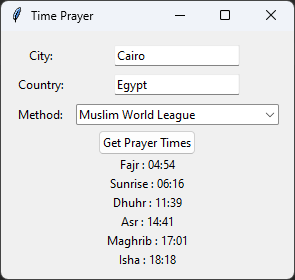
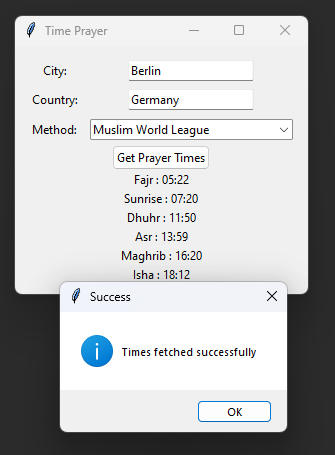
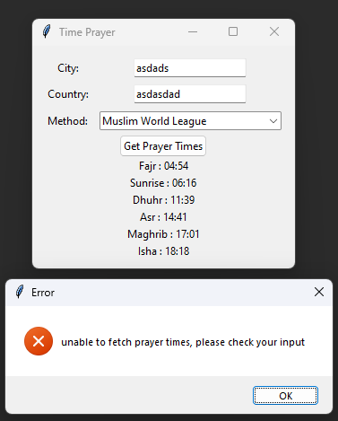

# PrayerTimes
Prayer times is a simple program that takes the city and the country that the city at and returns the Prays times according to the method that the use has choose.

To build this program I have used tkinter library for building the GUI, and requests library for sending requests.

The program uses the following https://aladhan.com/prayer-times-api to fetch Prays times using  Prayer "Times Calendar by address" only for now.

Beside that the program using threading to send the request on separate thread than the one that is responsible for the GUI, and prevent the program from freezing and mutex lock to prevent having several request at the same time.

 
